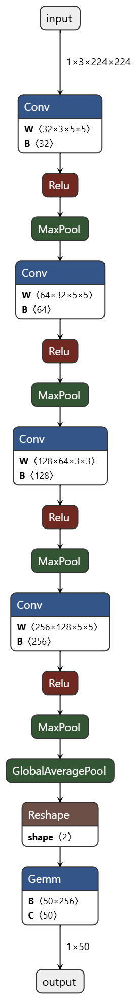
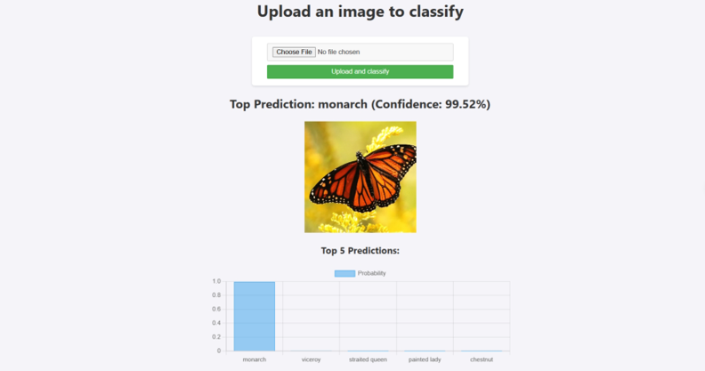

## BÀI TẬP KẾT THÚC LÝ THUYẾT ##
# BUTTERFLIES & MOTHS IMAGE CLASSIFICATION #
**LƯU Ý: BẠN ĐỌC NẾU MUỐN CLONE VỀ CHẠY THÌ NÊN ĐIỀU CHỈNH CÁC ĐƯỜNG DẪN TRONG CODE.**
### 1. Mô tả project ###
* Mục tiêu:
  - Sử dụng thư viện Pytorch để training mô hình CNN một cách hiệu quả. (Thư mục `butterflies`)
  - Giải quyết bài toán phân loại 50 loài bướm từ bộ dữ liệu Phân loại hình ảnh 50 loài bướm từ kaggle.
  - Convert Pytorch model to ONNX.
  - Triển khai PyTorch bằng Python thông qua API với Flask.
### 2. Butterflies & Moths Image Classification dataset"
  - Bộ dữ liệu Phân loại hình ảnh 50 loài bướm từ Kaggle chứa 4955 hình ảnh cho training, 250 hình ảnh cho validation và 250 hình ảnh để test. Và tất cả hình ảnh đều là hình ảnh RGB 224×224 chiều (có 3 kênh màu).
  - Mỗi folder train, validation và test đều có 50 thư mục con đóng vai trò là labels cho hình ảnh.
  - Cấu trúc thư mục input:
    ```
    ├── input
    │   ├── test
    │   │   ├── adonis
    │   │   │   ├── 1.jpg  
    │   │   ...
    │   │   └── zebra long wing
    │   │   	├── 1.jpg
    │   │   	...
    │   ├── train
    │   │   ├── adonis [96 entries exceeds filelimit, not opening dir]
    │   │   ...
    │   │   └── zebra long wing [108 entries exceeds filelimit, not opening dir]
    │   ├── valid
    │   │   ├── adonis
    │   │   │   ├── 1.jpg
    │   │   ...
    │   │   └── zebra long wing
    │   │   	├── 1.jpg
    │   │   	...
    ```
### 3. Xây dựng model CNN 
#### 3.1. Xác nhận các phép biến đổi để tăng cường dữ liệu.
* Cần thực hiện các phép biến đổi để đảm bảo tất cả hình ảnh được đưa vào mô hình AI đều có cùng kích thước.
  - `transforms.ToTensor()`: chuyển đổi hình ảnh sang tensor (là kiểu dữ liệu đa chiều được sử dụng trong pytorch). Về cơ bản, kỹ thuật này chuyển đổi các pixel của mỗi hình ảnh có màu thành độ sáng của màu, từ 0 đến 255. Các giá trị này được chia cho 255, vì vậy chúng có thể nằm trong khoảng từ 0 đến 1.
  - `transforms.Normalize(mean=[0.485, 0.456, 0.406], std=[0.229, 0.224, 0.225])`:  trừ đi giá trị trung bình rồi chia cho độ lệch chuẩn. Với mô hình được đào tạo trước, ta cần sử dụng các giá trị trung bình và độ lệch chuẩn mà Pytorch chỉ định. Có ba giá trị trong giá trị trung bình và độ lệch chuẩn để khớp với từng ảnh RGB.
* Các biến đổi tăng cường dữ liệu được thực hiện bằng thư viện torchvision.transforms.
  - `transforms.Resize((224))`: thay đổi kích thước hình ảnh sao cho cạnh ngắn nhất có chiều dài 224 pixel. Cạnh còn lại được chia tỷ lệ để duy trì tỷ lệ khung hình của hình ảnh.
  - `transforms.RandomHorizontalFlip(p=0.5)`: lật ngẫu nhiên hình ảnh theo chiều ngang.
  - `transforms.RandomVerticalFlip(p=0.5)`: lật ngẫu nhiên hình ảnh theo chiều dọc.
  - `transforms.ColorJitter(brightness=0.2, contrast=0.2, saturation=0.2)`: thay đổi ngẫu nhiên độ sáng, độ tương phản và độ bão hòa của hình ảnh.
  - `transforms.RandomAffine(degrees=0, translate=(0.1, 0.1), scale=(0.9, 1.1))`: thực hiện các phép biến đổi affine ngẫu nhiên như dịch chuyển, phóng to/thu nhỏ.
  - ...
#### 3.2. Nhập dữ liệu và đưa vào DataLoader.
* Ta input ảnh của mình vào chương trình bằng cách sử dụng thư viện `torchvision.datasets`.
* Ở đây cần chỉ định hai bộ dữ liệu khác nhau, một bộ dữ liệu để đào tạo mô hình (bộ đào tạo – training set) và bộ còn lại để kiểm tra mô hình (bộ xác thực – validation set).
```
# training dataset
train_dataset = datasets.ImageFolder(
    root='../butterflies/input/train',
    transform=train_transform
)
# validation dataset
valid_dataset = datasets.ImageFolder(
    root='../butterflies/input/valid',
    transform=valid_transform
)
```
* Sau đó, cần đưa hình ảnh đã nhập vào Dataloader. Dataloader có thể lấy ra các mẫu dữ liệu ngẫu nhiên, vì vậy, mô hình sẽ không phải xử lý toàn bộ tập dữ liệu một lần. Điều này làm cho việc đào tạo trở nên hiệu quả hơn.
* Ta có thể chỉ định số lượng hình ảnh xử lý cùng một lúc làm batch_size (ví dụ 32 có nghĩa là Dataloader sẽ trả về 32 mẫu cùng một lúc). Ta cũng có thể xáo trộn hình ảnh để nó được huấn luyện ngẫu nhiên vào mô hình với tham số shuffle=True.
```
# training data loaders
train_loader = DataLoader(
    train_dataset, batch_size=BATCH_SIZE, shuffle=True,
    num_workers=2, pin_memory=True
)
# validation data loaders
valid_loader = DataLoader(
    valid_dataset, batch_size=BATCH_SIZE, shuffle=False,
    num_workers=2, pin_memory=True
)
```
### 3.3. Xây dựng mô hình.
* Ta sử dụng thư viện `torch.nn` để tạo bộ phân loại.
  - `nn.Linear` chỉ định sự tương tác giữa hai lớp. Ta cung cấp cho nó 2 số, chỉ định số lượng nút trong hai lớp. Ví dụ: trong nn.Linear đầu tiên, lớp đầu tiên là lớp đầu vào và ta có thể chọn bao nhiêu số ta muốn trong lớp thứ hai.
  - `nn.ReLU` là chức năng kích hoạt cho các lớp ẩn. Các chức năng kích hoạt giúp mô hình tìm hiểu các mối quan hệ phức tạp giữa đầu vào và đầu ra. Ta sử dụng ReLU trên tất cả các lớp ngoại trừ đầu ra.
  - `nn.Conv2d` là lớp tích chập 2D (2-dimensional convolutional layer). Nó giúp trích xuất các đặc trưng từ hình ảnh đầu vào bằng cách áp dụng các kernel (hoặc filter) qua hình ảnh để phát hiện các đặc trưng như cạnh, góc, và các kết cấu phức tạp. 
  - `nn.MaxPool2d` là lớp pooling tối đa 2D. Nó giúp giảm kích thước không gian của các đặc trưng (feature maps) và làm cho mô hình bớt phức tạp và dễ xử lý hơn.
* Model bốn lớp tích chập. Và mỗi lớp tiếp theo có số lượng out_channels gấp đôi so với lớp trước đó.
* Mỗi lớp tích chập đều được theo sau bởi hàm kích hoạt ReLU và max-pool 2D. Chúng ta chỉ có một lớp tuyến tính với 50 out_features tương ứng với số lượng lớp trong tập dữ liệu. 
* Điều duy nhất cần lưu ý trong mạng nơ-ron này là kích thước kernel. Hai lớp tích chập đầu tiên có kernel kích thước 5×5, sau đó là lớp có kernel 3×3, và lớp cuối cùng lại có kernel kích thước 5×5.
* Cấu trúc model CNN được sử dụng trong project:


### 3.4. Train và đánh giá mô hình.
#### 3.4.1. Train.
* Trong khi đào tạo, ta cần xác định khả năng học của mô hình. Để đánh giá mức độ lỗi (loss) mà mô hình mắc phải, ta sử dụng `nn.CrossEntropyLoss`.
* Để đào tạo mô hình, cần chấp nhận lỗi và xem cách ta có thể điều chỉnh các trọng số đã nhân với các số của mình để có được lỗi nhỏ nhất. Phương pháp tính toán cách điều chỉnh trọng số và áp dụng nó cho trọng số trong mô hình được lấy ví dụ là Adam. Sử dụng thư viện `torch.optim` để áp dụng phương thức này và cung cấp cho nó các tham số.
```
# optimizer
optimizer = optim.Adam(model.parameters(), lr=lr)
# loss function
criterion = nn.CrossEntropyLoss()
```
Bắt đầu với tập train.
+ Trước tiên, đặt mô hình ở chế độ đào tạo và sử dụng for loop để duyệt qua mọi hình ảnh.
+ Sau đó, ta có thể tính toán đầu ra của mô hình dựa trên hình ảnh đầu vào và tính độ lỗi giữa kết quả dự đoán của mô hình và nhãn dữ liệu.
+ Tiếp theo, ta áp dụng các điều chỉnh cần thực hiện để giảm lỗi này bằng cách gọi hàm `loss.backward()` và sử dụng trình tối ưu hóa để điều chỉnh trọng số bằng cách gọi `optimizer.step()`.
Tiếp tục với bộ validation.
- Đặt mô hình ở chế độ đánh giá và sử dụng for loop để lặp lại tất cả các hình ảnh trong bộ dữ liệu.
- Lặp lại các bước đã thực hiện cho tập huấn luyện để lấy đầu ra của mô hình và mức độ sai lệch của mô hình so với nhãn thực.
- Để xác định xem nó đoán đúng bao nhiêu hình, ta kiểm tra xem lớp đoán nào bằng lớp thực. Sau đó, có thể lấy trung bình trên toàn bộ lượt để xác định độ chính xác của mô hình (có bao nhiêu hình ảnh mô hình đoán đúng trên tổng số lượng hình ảnh).
* Để bắt đầu việc train, ta sử dụng câu lệnh sau trên terminal: ```!python train.py --epochs 70``` (trên Google Colab) hoặc ```python train.py --epochs 70``` (trên IDE).

`--epochs 70` là ví dụ của việc sử dụng thư viện `argparse` giúp ta có thể thay đổi các chỉ số học tập theo yêu cầu cá nhân như learning rate, epoch,...
#### 3.4.2. Đánh giá mô hình.
* Để có thể theo dõi trực tiếp kết quả của quá trình train mô hình (train accuracy, validation accuracy,...) ta có thể sử dụng CometML như trong code `train.py`. API key và project name là của cá nhân từng người. Khi việc train bắt đầu, link theo dõi sẽ được hiển thị ở phần kết quả.
* Hoặc ta có thể sử dụng hàm `save_plots` như trong code `utils.py`, tuy nhiên kết quả sẽ được in và save trong thư mục `outputs` khi quá trình train kết thúc. Vì vậy sẽ có những trường hợp ta sẽ mất kết quả visualize khi thời gian train bị quá hạn (khá rủi ro).
* Kết quả quá trình train mô hình (được in ra bởi hàm `save_plots`):


Nhận xét:
- Độ chính xác của quá trình huấn luyện (train accuracy) cao hơn so với độ chính xác của quá trình xác thực (validation accuracy) vào cuối quá trình huấn luyện.
- Mô hình bị overfitting.
- Tuy nhiên, độ chính xác của quá trình xác thực khá ổn định, không giảm đáng kể, điều này cho thấy mô hình vẫn có khả năng dự đoán khá tốt trên dữ liệu mới.

### 4. Convert Pytorch model to ONNX
* Trong code `utils.py`, sử dụng hàm `torch.save` để lưu trữ trạng thái của mô hình, bộ tối ưu, và các thông tin liên quan khác vào một tệp tin.
**Khởi tạo một từ điển chứa các thông tin cần lưu:**
- 'epoch': epochs: Lưu số lượng epoch đã huấn luyện.
- 'model_state_dict': model.state_dict(): Lưu trạng thái của mô hình, bao gồm các tham số (weights) và độ lệch (biases) của các lớp trong mô hình.
- 'optimizer_state_dict': optimizer.state_dict(): Lưu trạng thái của bộ tối ưu (optimizer), bao gồm các tham số và thông tin cần thiết để tiếp tục tối ưu hóa sau này.
- 'loss': criterion: Lưu giá trị của hàm mất mát (loss function).
**Khởi tạo một từ điển chứa các thông tin cần lưu:**
- `torch.save({...}, '../butterflies/outputs/model.pth')`: Lưu từ điển chứa các thông tin cần thiết vào tệp tin model.pth trong thư mục `outputs`.
* Sau đó, sử dụng hàm `torch.onnx.export` để xuất mô hình đã huấn luyện sang định dạng ONNX:
```
import torch
import torch.onnx
from model import CNNModel

# Khởi tạo mô hình
model = CNNModel()

# Tải checkpoint
checkpoint = torch.load('model.pth', map_location=torch.device('cpu'))

# Tải trọng số mô hình từ checkpoint
model.load_state_dict(checkpoint['model_state_dict'])
model.eval()  # Chuyển mô hình sang chế độ đánh giá


dummy_input = torch.randn(1, 3, 224, 224)

torch.onnx.export(model, dummy_input, 'model.onnx', verbose=True, input_names=['input'], output_names=['output'])
```
### 5. Triển khai PyTorch bằng Python thông qua API với Flask.
* Nếu không hứng thú với việc triển khai API, ta có thể chạy code `inference.py` để kiểm tra khả năng dự đoán của model.
* Việc triển khai được thực hiện qua file `app.py`:
  - Tạo session ONNX Runtime.
  - Định nghĩa các phép biến đổi trên ảnh để resize, chuyển đổi thành tensor và chuẩn hoá ảnh.
  - Định nghĩa các nhãn (labels).
  - Định nghĩa route chính của ứng dụng Flask:
  - Đọc và chuyển đổi ảnh sang RGB.
  - Áp dụng các phép biến đổi đã định nghĩa.
  - Thêm một chiều batch vào ảnh và chuyển đổi thành numpy array.
  - Thực thi mô hình ONNX để dự đoán.
  - Tính xác suất và lấy top 5 dự đoán.
  - Chuyển đổi ảnh gốc sang định dạng base64 để hiển thị trên web.
  - Chuyển đổi kết quả dự đoán thành JSON để truyền cho template.
  - Chạy ứng dụng Flask.
* Giao diện web:

### 6. Khó khăn và hướng giải quyết.
### 6.1. Khó khăn.
- Mô hình bị overfitting.
- Dữ liệu cho tập validation quá nhỏ so với tập train.
- Validation accuracy thấp hơn train accuracy (ảo :> )
- Có thay đổi các siêu tham số như epoch, batch size,... để thí nghiệm nhưng vẫn xảy ra tình trạng overfitting.
- Chưa nắm rõ nhiều phương pháp tăng cường dữ liệu, hạn chế ở việc sử dụng mỗi `torch.transforms` để tăng cường.
### 6.2. Hướng giải quyết.
- Tăng cường dữ liệu, tăng cường dữ liệu, tăng cường dữ liệu!!! Cái gì quan trọng nói 3 lần.
- Tìm hiểu các kỹ thuật tăng cường dữ liệu.
- Tinh chỉnh mô hình: tìm hiểu và sử dụng transfer learning và fine-tuning để cải thiện hiệu suất mô hình.


